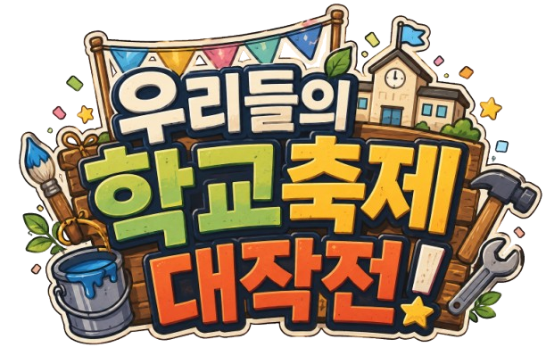

<p align="center">
  
</p>
<p align="center">
  카드 전략 X 타일 배치 X 자원 관리 = 학교 축제!
</p>
<h1 align="center">우리들의 학교축제 대작전!</h1>

<p align="center">
  <b>카드와 헥스 타일을 활용해 15일 동안 만들어가는 학교 축제 전략 게임</b>
</p>

<p align="center">
  <a href="../../releases/latest"><b>🎮 최신 버전 다운로드</b></a>
  &nbsp;&nbsp;|&nbsp;&nbsp;
  <a href="./DEVELOPMENT.md"><b>🛠️ 개발 및 기술 문서</b></a>
  &nbsp;&nbsp;|&nbsp;&nbsp;
  <a href="../../issues"><b>🐛 버그 제보</b></a>
</p>

## 🎮 게임 소개

**우리들의 학교축제 대작전!**은 제한된 **15일** 동안 학교 축제를 준비하는 카드 기반 전략 게임입니다.

갑작스럽게 축제 준비를 맡게 된 학생회장이 되어<br>
**자본, 자재, 인력**을 관리하고 다양한 프로젝트를 진행하세요.

카드를 사용하면 자원을 확보하거나 축제 준비를 진행할 수 있고,<br>
일부 카드는 학교 부지의 헥스 타일 위에 새로운 시설을 건설합니다.

시설은 어디에 배치하는지에 따라 서로 다른 효과와 점수를 만들어냅니다.

**과학**, **음악**, **미술**, **체육**, 그리고 **미스터리**까지.<br>
어떤 분야와 협력하고 어떤 방식으로 축제를 만들어갈지는 플레이어의 선택에 달려 있습니다.

**완성도 · 관심도 · 안정도**를 모두 확보한 뒤,<br>
남은 기간 동안 가능한 한 높은 **축제 점수**에 도전하세요.

## ⬇️ 다운로드

게임은 **GitHub Releases를 통해서만 배포합니다.**

### [▶ 최신 Windows 버전 다운로드](../../releases/latest)

1. 최신 Release에서 Windows용 압축 파일을 다운로드합니다.
2. 원하는 위치에 압축을 해제합니다.
3. 폴더 안의 실행 파일을 실행합니다.

게임을 플레이하려는 경우 저장소의 Source Code가 아니라<br>
**Releases에 첨부된 Windows 빌드**를 다운로드해주세요.

## 🛠️ 개발 정보

이 프로젝트는 **Unity / C#으로 제작한 개인 게임 프로젝트**입니다.<br>
주요 구현 요소는 다음과 같습니다.

- **ScriptableObject 기반 데이터 중심 카드 시스템**
- **Cube Coordinate System 기반 Hex Grid** 좌표 관리 및 인접 / 범위 탐색
- `Queue`와 `HashSet`을 이용한 **BFS 기반 연결 시설 탐색**
- **상속 기반 타일 시스템**과 시설별 액션 / 점수 계산
- 카드 / 자원 / 기술 / 타일을 연결하는 **턴 진행 시스템**
- 게임 상태 스냅샷 기반 **Undo 시스템**
- JSON 직렬화 기반 **저장 / 불러오기 및 세이브 슬롯**
- 분야별 **기술 / 일일 이벤트 / 업적 시스템**
- **프롤로그 / 대화 / 에필로그** 게임 진행 시스템

### [▶ 상세 개발 및 기술 문서 보기](./DEVELOPMENT.md)

구조를 선택한 이유, Undo와 Save 시스템의 구현 방식,<br>
현재 구조의 한계와 향후 개선 방향까지 별도 문서에 정리했습니다.


## ✨ 게임 시스템

### 🎴 카드

매일 새로운 카드를 얻고, 가지고 있는 자원을 이용해 프로젝트를 진행합니다.

카드에 따라 다음과 같은 효과가 발생합니다.

- 자원 및 생산량 변화
- 완성도 / 관심도 / 안정도 변화
- Tech 진행
- 새로운 카드 획득
- 시설 및 도로 건설
- 특수 효과 발동

눈앞의 효과만 보고 카드를 사용할지,<br>
남은 기간을 위해 자원 생산 기반을 먼저 마련할지 선택해야 합니다.

### 🗺️ 육각형 타일

일부 프로젝트는 학교 부지에 새로운 시설을 건설합니다.

시설은 헥스 타일 위에 배치되며,<br>
종류에 따라 주변 시설이나 지형과 상호작용합니다.

따라서 같은 시설을 사용하더라도 **어디에 배치했는지**에 따라 얻는 결과가 달라질 수 있습니다.

축제 준비뿐 아니라 최종 점수를 고려해 학교 부지를 구성하는 것이 중요합니다.

### 💰 자원

축제 준비에는 세 종류의 주요 자원이 사용됩니다.

| 자원 | 설명 |
| --- | --- |
| **자본** | 대부분의 프로젝트를 진행하는 기본 자원 |
| **자재** | 일부 카드에서 자본 비용을 대신할 수 있는 자원 |
| **인력** | 시설 행동 및 축제 운영에 사용되는 자원 |

각 자원에는 생산량이 존재합니다.

즉시 효과를 위해 자원을 사용할 것인지,<br>
생산량을 늘려 이후의 턴을 준비할 것인지 판단해야 합니다.

## 📊 축제 준비 지표

축제를 성공적으로 개최하려면 **완성도 · 관심도 · 안정도**를 모두 목표치까지 높여야 합니다.

### 🏗️ 완성도

축제에 필요한 시설과 즐길거리가 얼마나 충분히 갖추어졌는지를 나타냅니다.<br>
시설과 각종 축제 콘텐츠를 설치할수록 완성도가 상승합니다.

### 📣 관심도

학생과 방문객이 축제에 얼마나 관심을 가지고 있는지를 나타냅니다.<br>
홍보 활동, 공연, 행사 등을 통해 관심도를 높일 수 있습니다.

### 🛡️ 안정도

축제장 내 이동 동선과 기반 시설이 얼마나 잘 정비되어 있는지를 나타냅니다.<br>
도로를 설치할수록 안정도가 상승합니다.

세 가지 준비 지표를 모두 목표치까지 달성하면 성공적인 축제를 개최할 수 있습니다.<br>
이후에는 남은 기간 동안 **축제 점수**를 최대한 높이는 것이 최종 목표입니다.

## 🎓 분야별 플레이

각 분야는 동아리장이 축제 준비에 합류하면서 순차적으로 해금됩니다.

### 🔬 과학

**1일차, 과학 동아리장 카티노르가 합류합니다.**

축제 **완성도**를 높이고 카드 드로우를 강화해, 이후의 선택지와 준비 효율을 늘리는 분야입니다.

### 🎵 음악

**2일차, 음악 동아리장 비바체가 합류합니다.**

공연과 버스킹을 통해 축제 **관심도**를 크게 높일 수 있습니다.

게임 종료 시 **버스킹 부스와 연결된 음향 중계기**가 많을수록 더 많은 축제 점수를 획득합니다.

### 🎨 미술

**3일차, 미술 동아리장 스페이스가 합류합니다.**

작품과 전시를 통해 축제 **관심도와 완성도**를 함께 높일 수 있습니다.

**미술 작품**은 **전시회 본부**와 가까울수록 높은 점수를 얻습니다.

### 🏃 체육

**4일차, 체육 동아리장 슘이 합류합니다.**

**체육 본부**의 액션으로 **인력을 축제 점수로 전환**하는 점수 획득 특화 분야입니다.

**체육 어트랙션**을 많이 설치할수록 체육 본부의 점수 획득 능력이 강화됩니다.

### 🔮 미스터리

**5일차, 미스터리 동아리장 피노가 합류합니다.**

합류 이후에는 **매일 한 장씩 미스터리 카드**를 획득합니다.

미스터리 카드는 패널티를 가지는 대신 일반 카드보다 강력한 효과를 제공합니다.

## 📅 15일

축제까지 남은 시간은 **15일**입니다.

하루가 지나면 자원이 생산되고 새로운 카드를 얻게 되지만  
축제까지 남은 날짜 역시 하루씩 줄어듭니다.

모든 것을 한 번에 준비할 수 없기 때문에

**지금 필요한 것과 이후에 필요한 것을 구분하는 것**이 중요합니다.

<!--또한 매일 예상하지 못한 이벤트가 발생할 수도 있습니다. -->

## 🏆 기타 시스템

게임에는 핵심 전략 시스템 외에도 다음 기능이 포함되어 있습니다.

- 카드 덱 / 손패
- 툴팁 시스템
- 기술 시스템
- 타일 액션
- 일일 이벤트
- 저장 / 불러오기
- Undo (되돌리기)
- 업적 시스템
- 프롤로그 / 대화 / 에필로그
- 축제 결과
- 음향 조절 시스템
- 카메라 무브 시스템
- 파티클 이펙트

## 📦 Source Project

게임 소스를 확인하려는 경우 저장소를 Clone한 뒤 Unity에서 열 수 있습니다.

개발에 사용한 Unity 버전:

```text
Unity 2022.3.62f3
```

게임을 플레이하려는 경우에는 직접 빌드하는 것보다  
**GitHub Releases의 Windows 빌드 사용을 권장합니다.**

## 🐛 Bug Report

게임 플레이 중 문제가 발생하면 GitHub **Issues**를 이용해주세요.<br>
(아니면 그냥 메일 / DM 보내주세요.)

가능하다면 다음 정보를 함께 남겨주세요.

- 게임 버전
- 문제가 발생한 상황
- 재현 방법
- 스크린샷 또는 오류 메시지

## 📄 Asset / Copyright Notice

프로젝트 제작 과정에서 외부 리소스와 생성형 AI 이미지가 사용되었습니다.

### Illustration

게임에 사용된 일러스트는 **ChatGPT를 이용해 생성한 이미지**를 사용했습니다.

### Icons

일부 UI 아이콘은 **Flaticon**의 리소스를 사용했습니다.

- Usd-circle, Box, User, Road, Fire flame curved, Tachometer-alt-fastest — UIcons
- 실험 — Pixel perfect
- 추가하다 — Muhammad_Usman
- 명예 훈장 — Qadeer Hussain
- Musical note, 집 — Magnific
- Paint palette — apien
- Cardio workout — spacepixel
- Evil — AndrejsKirma
- 쓰레기통 — Magnific
- 새로고침 — lakonicon

### Fonts

- 국립공원공단 — **국립공원 꼬미**
- 유토이미지 — **유토이미지 꼬마나비**

### Music

- **OpenTracks (구 DOVA-SYNDROME)**

### Sound Effects

등록 음원 중 다음 아티스트의 리소스를 사용했습니다.

- Yodguard
- DRAGON-STUDIO

---

<p align="center">
  <b>15일 안에, 최고의 학교 축제를 만들어보세요!</b>
</p>